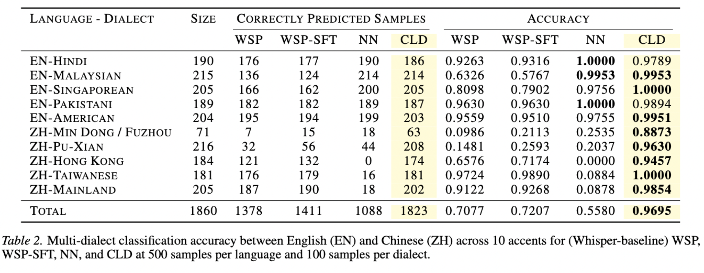

# Convex Low-Resource Accent-Robust Language Detection in ASR

## Overview
This repo presents CLD, an efficient pipeline for accent-robust, multilingual ASR with lightweight language detection. It integrates Whisper fine-tuning with a convex binary language head (cvxNN), implemented in JAX and optimized via ADMM for high performance in low-resource settings.




## Highlights
1) High Accuracy: Excels in binary and multiclass language detection (Table 2).
2) Low-Resource Robustness: Effective with limited data (Figures 1 & 2).
3) Efficient: 13x training speedup from traditional NNs due to ADMM optimization and JAX.

---

## Quick Start

### 1) Install
```bash
python -m venv .venv
source .venv/bin/activate
pip install -r requirements.txt
```

- NVIDIA GPU recommended.
- To verify JAX installs on your machine, you can try `python jaxtest.py` (optional for cvxNN work).

### 2) Ingest Data
Ingest multilingual audio into a Hugging Face `DatasetDict` with normalized audio and `train/valid/test` splits.

```bash
python data_ingestion.py \
  --config configs/en_hi_config.json \
  --out data/en_hi \
  --common-voice-dir /absolute/path/to/CommonVoice \
  --augment
```

- Required: `--config` JSON (see example below), `--out` save directory.
- Optional: `--augment` enables audiomentations; `--musan-dir` for background noise; `--common-voice-dir` for local Common Voice.
- Output: a saved `DatasetDict` at `data/en_hi` with columns: `audio`, `text`, `lang`, `accent`.

Minimal config example (see more in `configs/`):
```json
{
  "name": "English-Hindi example",
  "languages": {
    "en": {
      "accents": [
        { "code": "us", "column_name": "United States English", "dataset": "common_voice" }
      ]
    },
    "hi": {
      "accents": [
        { "code": "hi", "column_name": "", "dataset": "common_voice" }
      ]
    }
  },
  "params": {
    "samples_per_class": 1000,
    "split": { "train": 0.8, "val": 0.1, "test": 0.1 }
  }
}
```

Notes:
- Common Voice selection uses `column_name` against `accents` in `validated.tsv`. Use `override_code` to point to alternative folders (see `configs/final_config.json`).
- Lahaja examples match by `native_language` (e.g., `"Telugu"`, `"Konkani"`).

### 3) Fine-tune Whisper
Fine-tune Whisper with per-example language tokens and standard seq2seq training.

```bash
python whisper_training.py \
  --data_dir data/en_hi \
  --output_dir models/whisper-small-enhi-out \
  --model_id openai/whisper-small \
  --num_train_epochs 3 \
  --per_device_train_batch_size 8 \
  --per_device_eval_batch_size 8 \
  --eval_strategy steps \
  --eval_steps 1000 \
  --save_steps 1000 \
  --logging_steps 25 \
  --run_name whisper-small-enhi
```

Key details:
- The script loads from `--data_dir` via `load_from_disk`.
- Per-example language tokens are added from the dataset’s `lang` field.
- First 4 encoder layers are frozen by default to stabilize training.
- Metrics: WER (primary) and CER are computed and saved to `metrics_test.json` in `--output_dir`.

### 4) Train a Lightweight Binary Language Head (NN)
Train a small classifier on top of Whisper’s encoder to distinguish two languages.

```bash
python train_nn_cld.py \
  --data_dir data/en_hi \
  --lang1 en \
  --lang2 hi \
  --output_dir models/en_hi_nn \
  --num_train_epochs 10 \
  --per_device_train_batch_size 32 \
  --per_device_eval_batch_size 32 \
  --learning_rate 1e-5 \
  --gradient_accumulation_steps 2 \
  --report_to wandb
```

- Uses `WhisperModel` encoder (frozen) and adds a tiny MLP head (avg-pool over time → 2-way logits).
- Balanced training: prints per-split counts; training/eval on `train/valid` (with final `test` evaluation).
- Output model is saved in `--output_dir`.

### 5) Benchmark End-to-End
Run joint language detection and ASR to get WER/CER and classification metrics (overall + per-accent).

```bash
python benchmark_cld.py \
  --dataset_path data/en_hi \
  --whisper_path models/whisper-small-enhi-out \
  --cld_path models/en_hi_nn \
  --cld_type nn \
  --lang1 en \
  --lang2 hi \
  --batch_size 32
```

- Logs WER/CER, accuracy, macro/weighted F1, and per-accent tables to Weights & Biases.
- Per-sample predictions and classification reports are stored as W&B artifacts.

---

## Data Sources Supported
- **Common Voice** (local TSV + `clips/` audio). Provide `--common-voice-dir`. Selection via `accents` column; see `data_ingestion.py` for details.
- **Lahaja** (Hugging Face): loaded via `datasets`. Accents are matched by `native_language`.

Ingestion pipeline (high level):
- Mono + resample to 16 kHz
- Peak normalization to a safe dBFS window
- Noise reduction (skips ultra-quiet audio)
- Optional augmentations (time stretch, pitch shift, background noise)

