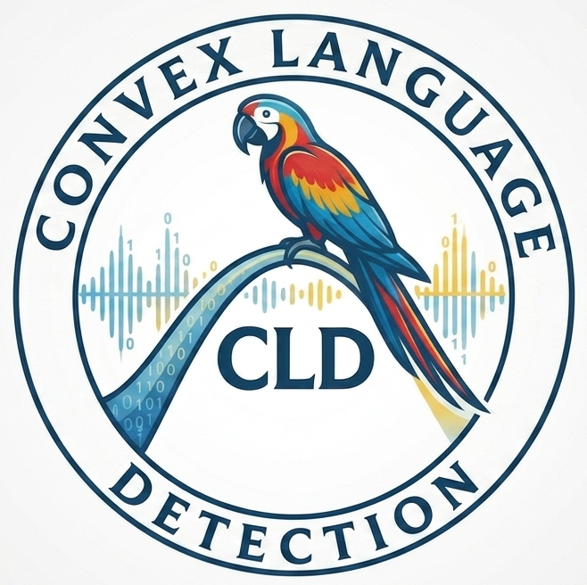
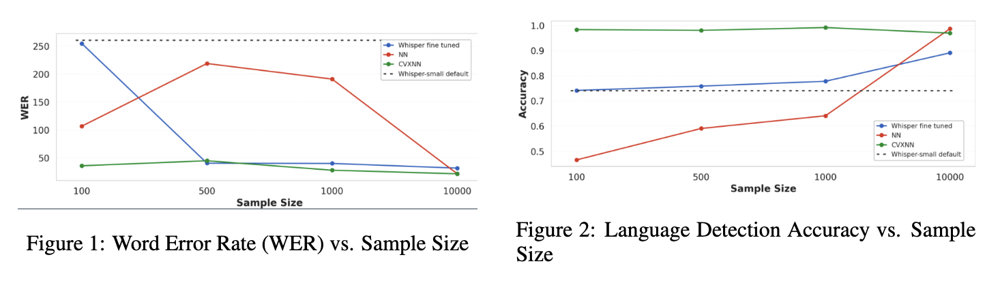
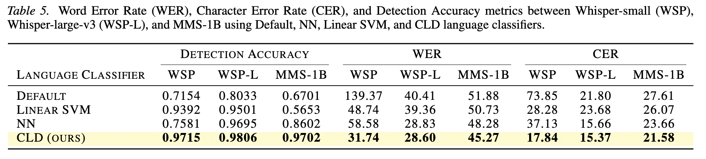

<table border="0" cellpadding="0" cellspacing="0">
<tr>
<td width="70%" valign="middle">

<h1>CLD</h1>

<b>Convex Low-resource Accent-Robust Language Detection in Speech Recognition</b><br>
A lightweight language-detection module for multilingual ASR, optimized via ADMM in JAX.

<p>
  <a href="https://icml.cc/virtual/2026/poster/64615"></a>
  <a href="https://pypi.org/project/jaxcld/"></a>
  
  
  
</p>

</td>
<td width="30%" valign="middle" align="right">

</td>
</tr>
</table>

---

This repository provides the official implementation of **CLD**, a lightweight language-detection module for multilingual ASR. This codebase contains our pip-installable Python package (`cld/`) including our training/benchmark scripts implemented in JAX and optimized via ADMM for high performance in low-resource settings. Simply, the package attaches a small language detection head (Convex NN / small NN / linear SVM) to ASR encoder representations, and use it to select the language token (Whisper) or adapter (MMS) before decoding.

The paper PDF is available in [`paper/`](paper/) and the pip-installable package is published at [pypi.org/project/jaxcld](https://pypi.org/project/jaxcld/).



## Highlights

- High Accuracy: Excels in binary and multiclass language detection (Table 2).
- Low-Resource Robustness: Effective with limited data (Figures 1 & 2).
- Efficient: 13x training speedup from traditional NNs due to ADMM optimization and JAX.

<!-- 
## What’s in this repo

- **`cld/`**: package with `ASRModel` adapters (Whisper + MMS) and language detection heads
- **Training scripts**
  - **Whisper fine-tuning**: `train_whisper.py`
  - **Convex head (CVXNN, JAX + ADMM/CRONOS)**: `train_cvxnn.py`
  - **Small NN head (PyTorch)**: `train_nn.py`
  - **Linear SVM head (sklearn)**: `train_linear_svm.py`
- **Evaluation**: `benchmark_cld.py` (language detection metrics + WER/CER, with optional per-accent breakdown)
- **Tests**: `tests/` (smoke-tests for loading heads and running inference end-to-end) -->

## Requirements

This repo supports two common setups:

- **Package-only install** (inference usage):

```bash
pip install -e .
```

- **Full training/benchmark environment** (recommended if you run the scripts in this repo):

```bash
pip install -e ".[train]"
```

If you prefer installing from the pinned dependency list instead:

```bash
pip install -r requirements.txt
```

## Using the package

### Minimal inference example (Whisper)

```python
import numpy as np

from cld import ASRModel, CVXNNLangDetectHead, NNLangDetectHead, SVMLangDetectHead

# 1) Load the base ASR model
languages = ["en", "hi", "id", "ms", "zh"]
asr = ASRModel.from_pretrained("openai/whisper-small", config={"languages": languages})

# 2) Load a language detection head artifact (choose ONE)
# head = CVXNNLangDetectHead.load("path/to/whisper-small_trained_cvx_mlp.pkl", asr)
# head = NNLangDetectHead.load("path/to/openai_whisper-small_nn_head.pkl", asr)
# head = SVMLangDetectHead.load("path/to/openai_whisper-small_linear_svm.pkl", asr)

# 3) Attach head and run inference
asr.set_lang_detect_head(head)

audio_16k_mono: np.ndarray = ...  # shape (T,), sampling rate 16kHz
pred_langs, pred_texts = asr.predict(audio_16k_mono)
print(pred_langs[0], pred_texts[0])
```

## Training

## Data format

All training/evaluation scripts expect a **Hugging Face `DatasetDict` saved to disk** (loaded via `datasets.load_from_disk(...)`) with splits like `train`, `valid`, `test`. Use our `data_ingestion.py` script to prepare your data.

```bash
python data_ingestion.py \
  --config configs/en_hi_config.json \
  --out data/en_hi \
  --common-voice-dir /absolute/path/to/CommonVoice \
  --augment
```

- Required: `--config` JSON (see example below), `--out` save directory.
- Optional: `--augment` enables audiomentations; `--musan-dir` for background noise; `--common-voice-dir` for local Common Voice.
- Output: a saved `DatasetDict` at `data/en_hi` with columns: `audio`, `text`, `lang`, `accent`.

Minimal config example (see more in `configs/`):
```json
{
  "name": "English-Hindi example",
  "languages": {
    "en": {
      "accents": [
        { "code": "us", "column_name": "United States English", "dataset": "common_voice" }
      ]
    },
    "hi": {
      "accents": [
        { "code": "hi", "column_name": "", "dataset": "common_voice" }
      ]
    }
  },
  "params": {
    "samples_per_class": 1000,
    "split": { "train": 0.8, "val": 0.1, "test": 0.1 }
  }
}
```

Notes:
- Common Voice selection uses `column_name` against `accents` in `validated.tsv`. Use `override_code` to point to alternative folders (see `configs/final_config.json`).
- Lahaja examples match by `native_language` (e.g., `"Telugu"`, `"Konkani"`).

### Train language detection heads

All heads are trained on **pooled encoder embeddings** extracted by `ASRModel.load_data(...)` from a dataset on disk.

#### CVXNN (convex head, JAX + ADMM/CRONOS)

```bash
python train_cvxnn.py \
  --model_name openai/whisper-small \
  --dataset_path data/multiclass \
  --languages en,hi,id,ms,zh \
  --output_dir models/lang_heads \
  --neuron 64 \
  --beta 0.001 \
  --rho 0.1 \
  --admm_iters 6
```

This produces a pickled artifact like:
- `models/lang_heads/openai/whisper-small/openai_whisper-small_trained_cvx_mlp.pkl`

#### NN head (PyTorch)

```bash
python train_nn.py \
  --dataset_path data/multiclass \
  --model_name openai/whisper-small \
  --languages en,hi,id,ms,zh \
  --output_dir models/lang_heads \
  --num_train_epochs 10 \
  --learning_rate 1e-3 \
  --per_device_train_batch_size 256
```

This produces a pickled artifact like:
- `models/lang_heads/openai/whisper-small/openai_whisper-small_nn_head.pkl`

#### Linear SVM head (sklearn)

```bash
python train_linear_svm.py \
  --model_name openai/whisper-small \
  --data_dir data/multiclass \
  --languages en,hi,id,ms,zh \
  --output_dir models/lang_heads \
  --C 1.0 \
  --max_iter 5000
```

This produces a pickled artifact like:
- `models/lang_heads/openai/whisper-small/openai_whisper-small_linear_svm.pkl`


#### Fine-tune Whisper

Use `train_whisper.py` to fine-tune a Whisper checkpoint on a preprocessed dataset directory:

```bash
python train_whisper.py \
  --data_dir data/multiclass \
  --model_id openai/whisper-small \
  --output_dir models/whisper-small-finetuned \
  --num_train_epochs 3 \
  --learning_rate 1e-5 \
  --per_device_train_batch_size 8 \
  --per_device_eval_batch_size 8 \
  --gradient_accumulation_steps 1 \
  --eval_strategy steps \
  --eval_steps 1000 \
  --save_steps 1000
```

Optional logging:

```bash
python train_whisper.py ... \
  --wandb_project CLD \
  --run_name whisper-small-finetune-final_dry
```

## Evaluation

Use `benchmark_cld.py` to evaluate **language detection** and **transcription quality** (WER/CER) on the `test` split.

### Whisper + CVXNN head

```bash
python benchmark_cld.py \
  --dataset_path data/multiclass \
  --model_name openai/whisper-small \
  --cld_type cvx \
  --cld_path models/lang_heads/openai/whisper-small/openai_whisper-small_trained_cvx_mlp.pkl \
  --languages en,hi,id,ms,zh \
  --batch_size 32 \
  --no_wandb
```

### Whisper + NN head

```bash
python benchmark_cld.py \
  --dataset_path data/multiclass \
  --model_name openai/whisper-small \
  --cld_type nn \
  --cld_path models/lang_heads/openai/whisper-small/openai_whisper-small_nn_head.pkl \
  --languages en,hi,id,ms,zh \
  --batch_size 32 \
  --no_wandb
```

### Whisper + linear SVM head

```bash
python benchmark_cld.py \
  --dataset_path data/multiclass \
  --model_name openai/whisper-small \
  --cld_type linear_svm \
  --cld_path models/lang_heads/openai/whisper-small/openai_whisper-small_linear_svm.pkl \
  --languages en,hi,id,ms,zh \
  --batch_size 32 \
  --no_wandb
```

### Whisper vanilla language ID (no head)

```bash
python benchmark_cld.py \
  --dataset_path data/multiclass \
  --model_name openai/whisper-small \
  --cld_type vanilla \
  --languages en,hi,id,ms,zh \
  --batch_size 32 \
  --no_wandb
```

<!-- ## Pre-trained models

_TBD._ This repo supports loading three head types:

| Head type | Artifact | Loader |
| --- | --- | --- |
| CVXNN | `*_trained_cvx_mlp.pkl` | `CVXNNLangDetectHead.load(...)` |
| NN | `*_nn_head.pkl` | `NNLangDetectHead.load(...)` |
| Linear SVM | `*_linear_svm.pkl` | `SVMLangDetectHead.load(...)` | -->

## Results

Paper results (Table 5):



To reproduce the evaluation numbers for a given head, run `benchmark_cld.py` as shown in the Evaluation section.
<!-- 
## Tests

```bash
pytest -q
```

Note: tests are designed to **skip** if the local dataset at `data/test/final_dry/` is missing or if large model weights are unavailable.

## Contributing

- **Bugs / features**: please open an issue with a minimal reproduction.
- **Pull requests**: keep changes focused, add/update tests when behavior changes, and document new scripts/flags in `README.md`.

## License

MIT (see `pyproject.toml`). -->

## Citation

If you use this code in your work, please cite the paper:

```bibtex
@inproceedings{feng2026cld,
  title     = {Convex Low-resource Accent-Robust Language Detection in Speech Recognition},
  author    = {Feng, Miria and Tan, William and Pilanci, Mert},
  booktitle = {Proceedings of the 43rd International Conference on Machine Learning (ICML)},
  series    = {PMLR},
  volume    = {306},
  year      = {2026},
  address   = {Seoul, South Korea},
  url       = {https://icml.cc/virtual/2026/poster/64615}
}
```

<!-- ## Questions / missing info (to finalize this README)

- **Paper metadata**: what is the final paper title, author list, venue, and arXiv/camera-ready link?
- **Dataset recipe**: how should users reproduce `data/test/final_dry/` from raw sources (which datasets, filtering, splits, and preprocessing)?
- **Accent labels**: what is the definition/source of the `accent` field (taxonomy + how it’s derived)?
- **Default language set**: is `en,hi,id,ms,zh` the canonical set, or just the example from your experiments?
- **Pretrained artifacts**: where should the pretrained Whisper checkpoints and head artifacts be hosted (HF Hub / Google Drive / release assets), and what are the exact filenames?
- **Reproduction commands**: which exact `train_*` commands correspond to Table 5 (hyperparameters + seeds + compute setup)? -->